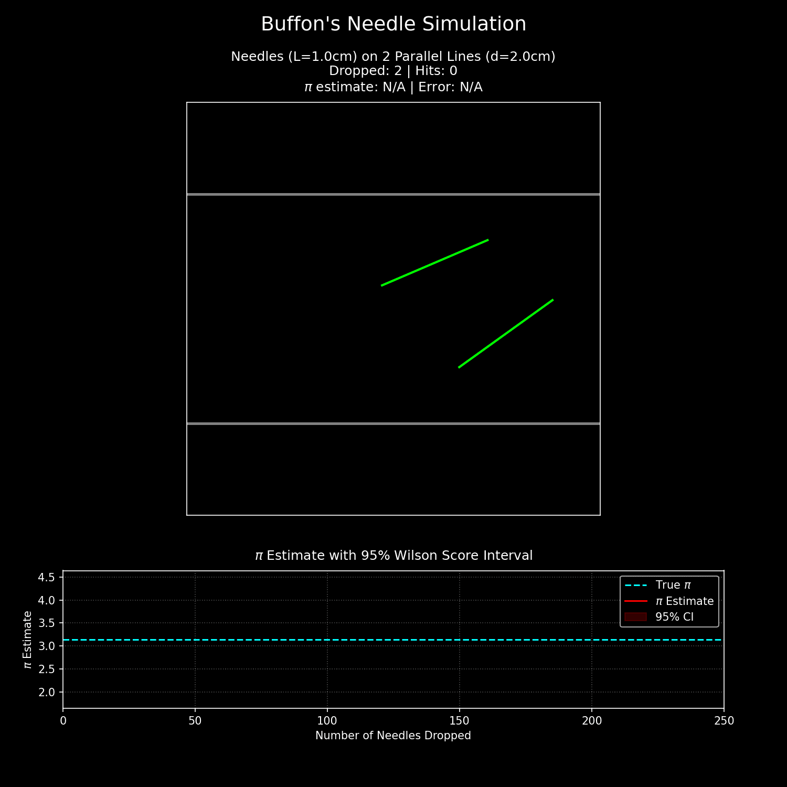
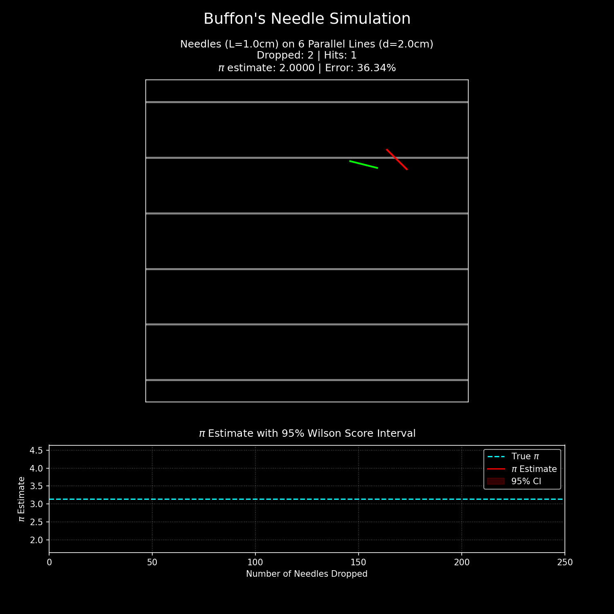
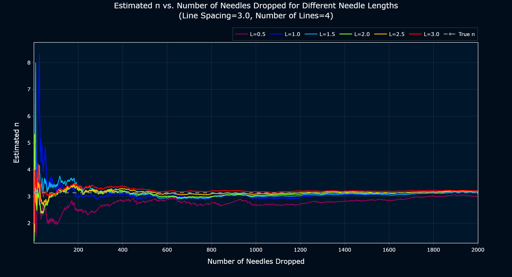

# 🧮 Exploring Pi: Buffon's Needle and Buffon-Laplace Simulations

This repository contains a Jupyter notebook and supporting materials for exploring geometric probability through Buffon's Needle Experiment, Buffon-Laplace extensions, and related simulations. By simulating random geometric configurations, we estimate the mathematical constant π, delving into both classical and extended probabilistic frameworks. The repository includes animations, images, a requirements file, and the main notebook, providing a comprehensive resource for understanding and visualizing these experiments.

## 🗂️ Repository Overview

Geometric probability bridges mathematics, probability, and computation, offering a unique approach to estimating constants like $\pi$ through random processes. This repository focuses on:
- **Buffon's Needle Experiment**: Simulating needles dropped onto parallel lines to estimate $\pi$, with variations in needle length and grid configurations.
- **Buffon-Laplace Extension**: Extending the problem to 2D grids (rectangular, triangular, and diamond) for richer probability calculations.
- **Buffon's Noodle Experiment**: Analyzing V- and W-shaped objects dropped onto parallel lines.
- **2D Shapes on Grids**: Investigating squares dropped onto rectangular grids, as detailed in the ["INVESTIGATION ON BUFFON-LAPLACE NEEDLE PROBLEM" (Hang Lung Mathematics Awards, 2021)](https://hlma.hanglung.com/assets/069C8B61-49B2-425D-BCC1-509A324A64AB/17-HM_WYK.pdf).

Through simulations, mathematical derivations, and visualizations, this repository provides both theoretical insights and practical implementations for enthusiasts of probability and computational mathematics.

## 📁 Repository Structure

- 📽️ **`ANIMATIONS/`**: Contains animation files visualizing the simulations (e.g., needle drops, shape intersections).
- 🖼️ **`IMAGES/`**: Stores static images, such as plots and diagrams generated by the notebook.
- 📦 **`requirements.txt`**: Lists Python dependencies required to run the notebook.
- 📓 **`Geometric_Probability_Experiments.ipynb`**: The main Jupyter notebook containing simulations, derivations, and visualizations.
- 📄 **`LICENSE`**: MIT License file for the repository.
- 📖 **`README.md`**: This file, providing an overview and setup instructions.

## 📝 Table of Contents (Notebook)
- **1. Buffon's Needle Experiment**  
    Simulating the classic experiment of dropping needles onto parallel lines to estimate the value of $\pi$.

    - **1.1 Simulation with 2 Parallel Lines**  
        Demonstrating the basic Buffon's Needle setup with two parallel lines and analyzing intersection probabilities.
        
        

    - **1.2 Simulation with N Parallel Lines**  
        Extending the experiment to multiple parallel lines to observe statistical effects and improve estimation accuracy.

        

        - **1.2.1 Effect of Needle Length on Pi Estimation**  
            Investigating how varying the length of the needle influences the probability of intersection and the estimation of $\pi$.

            

    - **1.3 Buffon-Laplace Extension: 2D Grids**  
        Exploring the Buffon-Laplace problem by dropping needles onto two-dimensional grids for more complex probability calculations.

        - **1.3.1 Rectangular Grid**  
            Simulating needle drops on a rectangular grid and analyzing intersection outcomes.

            

        - **1.3.2 Triangular Grid**  
            Extending the simulation to triangular grid patterns and comparing results.

            

        - **1.3.3 Diamond Grid**  
            Investigating the effects of a diamond-shaped grid on intersection probabilities.

            

- **2. Buffon's Noodle Experiment**  
    Analyzing the probability of intersection when dropping bent or composite shapes (noodles) onto parallel lines.

    - **2.1 Dropping V-Shapes on Parallel Lines**  
        Simulating the drop of V-shaped objects and studying their intersection behavior.

        

    - **2.2 Dropping W-Shapes on Parallel Lines**  
        Extending the experiment to W-shaped objects for further probabilistic analysis.

        

- **3. Buffon-Laplace Extension: 2D Shapes on Rectangular Grids**  
    Dropping two-dimensional shapes, such as squares, onto rectangular grids to explore advanced geometric probability scenarios.

    

## 🚀 Getting Started

### 🛠️ Prerequisites
- Python 3.8+
- Jupyter Notebook or JupyterLab
- Dependencies listed in `requirements.txt`

### ⚙️ Installation
1. Clone the repository:
   ```bash
   git clone https://github.com/PuspenduPH/Buffon-Laplace-Needle-Simulations.git
   cd Buffon-Laplace-Needle-Simulations
   ```
2. Create a virtual environment (optional but recommended):
   ```bash
   python -m venv venv
   source venv/bin/activate  # On Windows: venv\Scripts\activate
   ```
3. Install dependencies:
   ```bash
   pip install -r requirements.txt
   ```
4. Launch Jupyter Notebook:
   ```bash
   jupyter notebook
   ```
5. Open `buffon_pi.ipynb` to explore the simulations.

### ▶️ Usage
- Run the notebook cells sequentially to execute simulations and generate visualizations.
- Check the `ANIMATIONS/` and `IMAGES/` folders for outputs like animated needle drops or probability plots.
- Modify parameters (e.g., needle length, grid spacing) in the notebook to experiment with different configurations.

## 📜 License
This project is licensed under the MIT License. See the [LICENSE](LICENSE) file for details.

